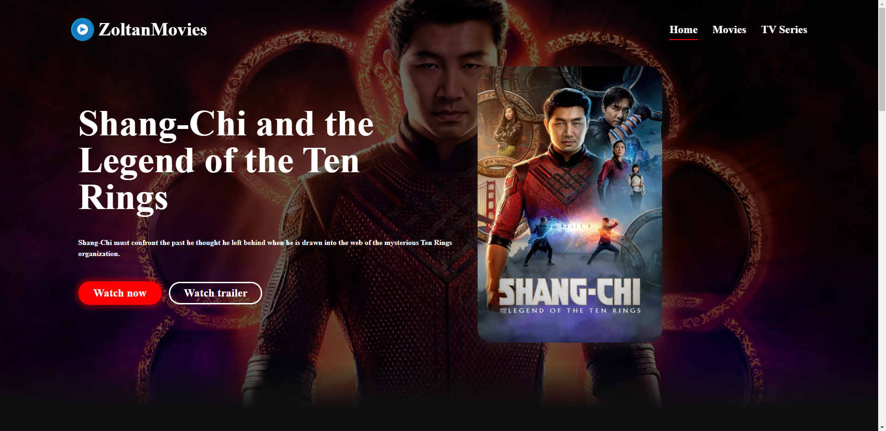
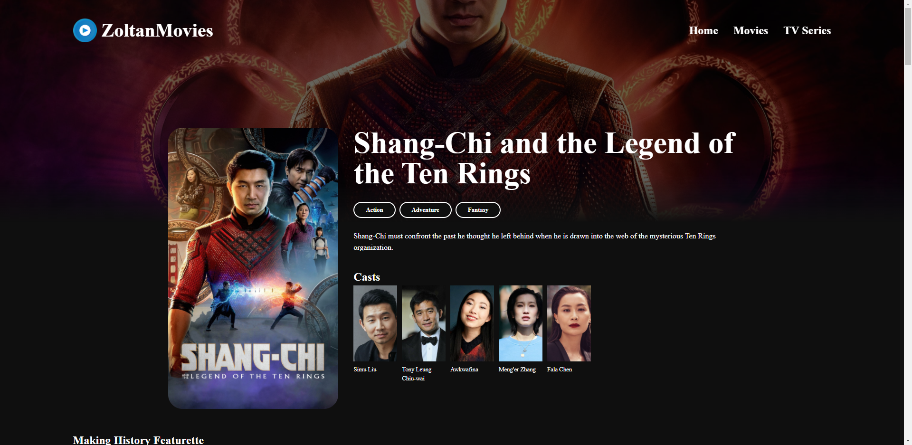
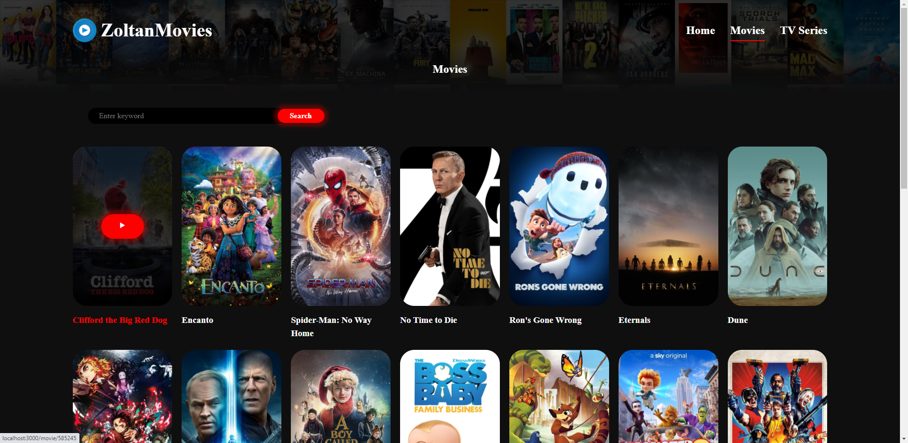

# Zoltan Movies

A responsive web app to find and discover movies using resources from themoviedb.org.

## Technologies used

- React
- Typescript
- HTML
- CSS
- SASS
- Boxicons
- Axios

## Sneak-peak

## Available Scripts

In the project directory, you can run:

### `yarn start`

Runs the app in the development mode.\
Open [http://localhost:3000](http://localhost:3000) to view it in the browser.

The page will reload if you make edits.\
You will also see any lint errors in the console.
